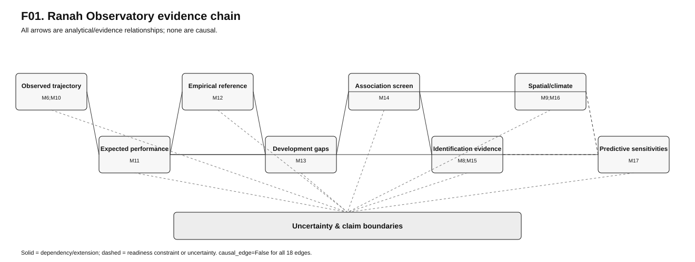
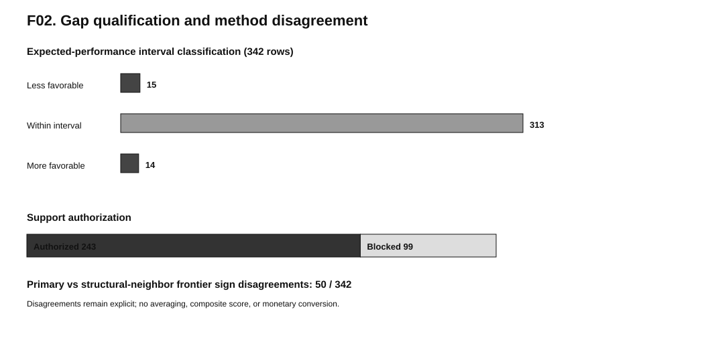
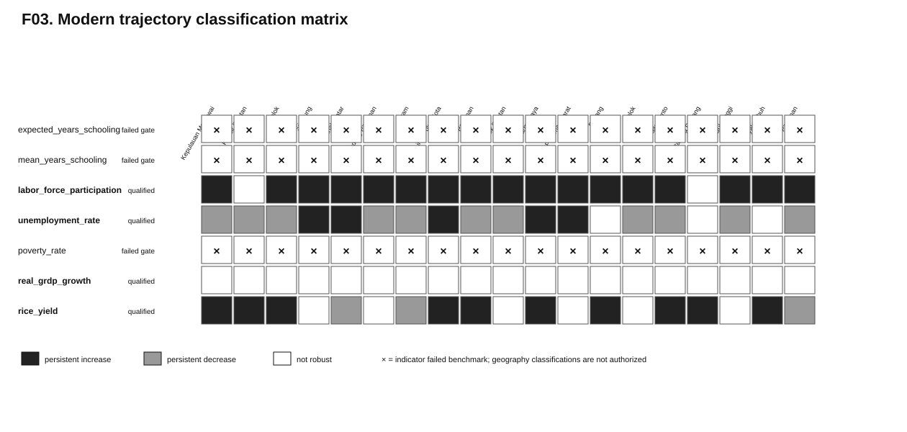
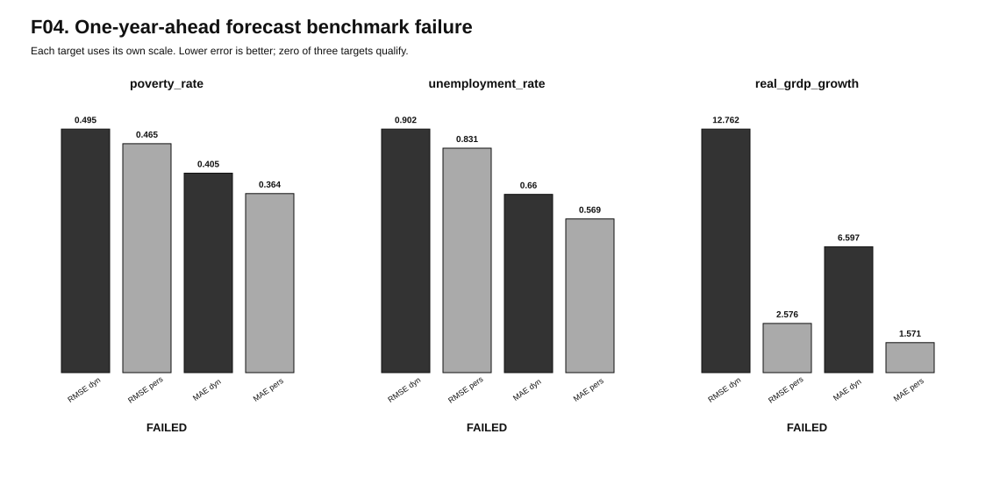
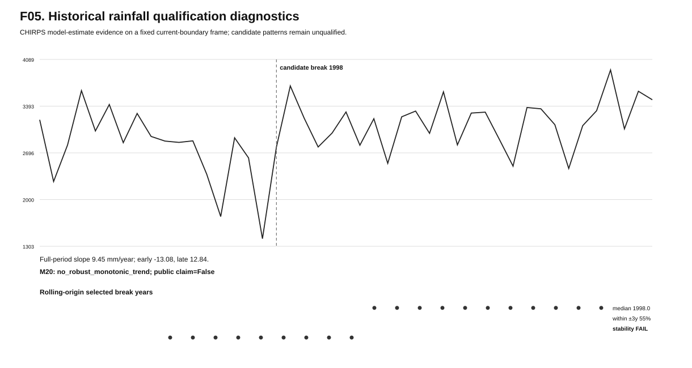
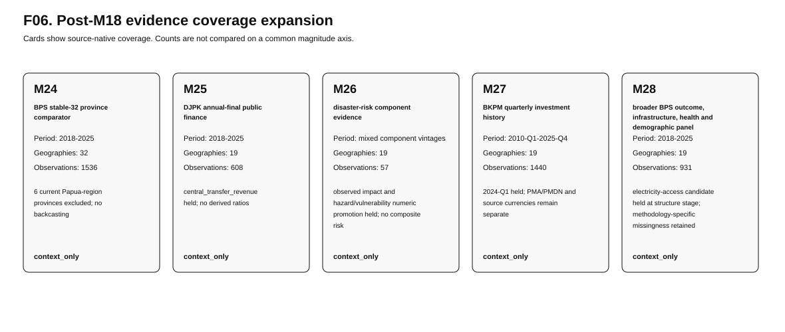

# Ranah Observatory: A Reproducible Evidence Framework for Development Gaps, Socioeconomic Trajectories, and Climate-Disaster Constraints in West Sumatra

**Nabil Rizki Navisa**  
Independent Researcher  
Technical report / preprint v0.1 · 2026-08-23 · CC BY 4.0

> **Citation-layer boundary:** bracketed `REF:` citations below document source families and methods already used by the frozen research package. They do not alter claim IDs, analytical results, or inference status.

**Technical report / preprint v0.1**  
Frozen analytical base: `e1571e63fd19222c0f6112d340b61ed5d7996e58`

## Abstract

Ranah Observatory is a reproducible evidence framework for studying development outcomes in West Sumatra while separating descriptive evidence, predictive comparison, empirical favorable references, association, causal identification, scenario sensitivity, and policy readiness. In the qualified modern regime, cross-fitted models for poverty, unemployment, and real-GRDP growth generated 342 geography-out predictions and beat the preregistered same-year peer-mean benchmark on both RMSE and MAE, permitting bounded expected-performance comparisons but not causal interpretation. The corresponding development-gap layer contains 342 geography-year-target rows, of which 15 are materially less favorable than expected, 313 lie within expected intervals, and 14 are materially more favorable; stronger gap interpretation is support-authorized for 243 rows and blocked for 99. `[C11_EXPECTED_PERFORMANCE]` `[C13_GAP_DISTRIBUTION]`

The framework also retains results that fail qualification. None of three one-year-ahead dynamic forecast targets beats own-lag persistence on both RMSE and MAE, so substantive 2026 forecasts remain blocked. Across 19 current-boundary geographies, zero pass the preregistered robust monotonic CHIRPS rainfall-trend gate for 1981-2025, and a candidate 1998 rainfall break fails the separate predictive and breakpoint-stability criteria for a qualified regime shift. A hierarchical trajectory model qualifies for four of seven modern socioeconomic indicators, while schooling and poverty trajectory classifications fail the locked benchmark. `[N19_FORECAST_FAILURE]` `[N20_MONOTONIC_RAINFALL]` `[N21_REGIME_SHIFT]` `[N22_SCHOOLING_POVERTY_TRAJECTORY]`

The report therefore does not estimate a definitive monetary value of West Sumatra's “wasted potential,” treat empirical favorable references as theoretical maxima, convert predictive residuals into causal underperformance, or rank policies by expected return. Its contribution is instead an auditable claim-gated research substrate that makes positive evidence, negative results, unresolved components, and prohibited inference visible in the same publication package. `[B01_MONETARY_WASTED_POTENTIAL]` `[B02_THEORETICAL_MAXIMUM]` `[B03_CAUSAL_RESIDUAL]` `[B09_POLICY_RANKING]`

## 1. Introduction

Development-gap research becomes unreliable when distinct questions are collapsed into one headline number. Observed outcomes describe what happened; predictive expectations describe what a model would expect under a specified comparison regime; empirical favorable references describe comparatively favorable observed configurations; causal studies ask whether an identified intervention or shock changed an outcome; and policy ranking additionally requires evidence about feasible interventions, effects, costs, implementation horizons, risks, and uncertainty. Ranah Observatory is designed to preserve these distinctions rather than allowing evidence from one layer to silently inherit the interpretation of another. `[C11_EXPECTED_PERFORMANCE]` `[C12_EMPIRICAL_REFERENCE]` `[C15_IDENTIFICATION_DISCIPLINE]` `[B09_POLICY_RANKING]`

The core analytical chain begins with a current-boundary modern panel for 19 West Sumatra kabupaten/kota. It then estimates cross-fitted expected performance for poverty, unemployment, and real-GRDP growth; calibrates empirical favorable references; measures model-relative gaps subject to support rules; screens preregistered lagged associations; records identification-ready and non-identification-ready causal evidence; preserves climate and disaster-component constraints; and evaluates predictive model-state sensitivities without relabeling them as interventions. `[C11_EXPECTED_PERFORMANCE]` `[C12_EMPIRICAL_REFERENCE]` `[C13_GAP_DISTRIBUTION]` `[C14_RAINFALL_ASSOCIATION]` `[C15_IDENTIFICATION_DISCIPLINE]` `[C17_PREDICTIVE_SENSITIVITY]`

This architecture is intentionally fail-closed. The favorable reference is empirical and conditional, not a theoretical production frontier. A model residual is not a causal estimate of underperformance. Distance from a favorable reference is not a guaranteed policy gain. A statistically stable association is not automatically an identified mechanism. Predictive scenario sensitivity is not a treatment effect or a forecast. `[B02_THEORETICAL_MAXIMUM]` `[B03_CAUSAL_RESIDUAL]` `[B04_GUARANTEED_POLICY_GAIN]` `[B05_CAUSAL_RAINFALL_UNEMPLOYMENT]` `[B08_SENSITIVITY_AS_POLICY_EFFECT]`

The same discipline applies to evidence expansion. After the first analytical synthesis, the repository added a stable-boundary national comparator panel, district/city public-finance observations, disaster-risk components, quarterly investment realization, and broader health, infrastructure, economic-level, and demographic indicators. These additions materially improve the evidence base, but in v0.1 they remain context unless an already-completed upstream analysis authorizes a stronger interpretation. `[X24_NATIONAL_COMPARATOR]` `[X25_PUBLIC_FINANCE]` `[X26_DISASTER_COMPONENTS]` `[X27_INVESTMENT_HISTORY]` `[X28_BROADER_PANEL]`

The objective of this report is therefore narrower and more defensible than a single “wasted potential” score. It asks what the frozen evidence base can already support, what preregistered analyses failed, where methods disagree, which components remain unresolved, and what kinds of evidence would be required before stronger causal or policy claims could be justified. `[B01_MONETARY_WASTED_POTENTIAL]` `[B09_POLICY_RANKING]`

## 2. Evidence architecture and data regimes

> **Canonical publication assets for this section:** Figure F01 (evidence chain), Table T01 (evidence/claim architecture), and Table T02 (modern panel/evidence expansion).

### 2.1 Primary modern kabupaten/kota regime

> **Source/method documentation:** `[REF:BPS_WEBAPI]` `[REF:BIG_BOUNDARIES]`

The principal modern analytical regime covers 19 current West Sumatra kabupaten/kota over 2018-2025. The original integrated panel contains 15 indicators and preserves missingness rather than imputing values or filling time mechanically. M28 later creates a separate Panel v2 rather than overwriting that base: seven additional BPS indicators add 931 observations, producing 22 indicators, 2,679 present observations across 152 geography-year rows, 665 explicit missing cells, and 10 indicators with complete 2018-2025 coverage. `[X28_BROADER_PANEL]`

Panel v2 adds real GRDP per capita at constant 2010 prices, morbidity rate, JKN membership coverage, internet access among persons aged five and above, adequate sanitation access, adequate drinking-water access, and dependency ratio. Their source-specific methodology regimes remain attached to the observations; for example, drinking-water and dependency-ratio series include explicitly differentiated observed, backcast-estimate, census-anchor, and model-projection semantics rather than being flattened into one homogeneous data type. `[X28_BROADER_PANEL]`

### 2.2 Historical climate regime

> **Source/method documentation:** `[REF:CHIRPS3_DATA_2025]` `[REF:FUNK_ET_AL_2026_CHIRPS3]`

The historical rainfall layer uses CHIRPS model-estimate evidence from 1981-2025 aggregated on fixed current boundaries for the same 19 geographies. This design supports a reproducible current-boundary historical climate series, but it does not claim equivalence to station observations, historical administrative-boundary continuity, or anthropogenic climate-change attribution. Independent station validation remains pending and is not a dependency for this v0.1 report. `[N20_MONOTONIC_RAINFALL]`

### 2.3 Stable national comparator regime

The national comparator layer covers 32 stable-boundary current provinces over 2018-2025 for six BPS indicators: poverty, Gini ratio, unemployment, underemployment, real GRDP per capita, and NEET. The materialized panel contains 1,536 observations and 48 provenance records backed by 48 frozen dynamic snapshots. Six current Papua-region province codes are deliberately excluded instead of being backcast across later administrative splits. `[X24_NATIONAL_COMPARATOR]`

This national layer expands comparative context but does not directly enlarge the 19-kabupaten/kota training sample. Province and district/city observations are not pooled into one statistical model in the frozen research base. `[X24_NATIONAL_COMPARATOR]`

### 2.4 Public finance, disaster components, investment, and broader outcomes

> **Source/method documentation:** `[REF:DJPK_SIKD_APBD]` `[REF:BKPM_REALIZATION_REPORTS]` `[REF:BKPM_SATUDATA]` `[REF:BNPB_INARISK_METHOD]` `[REF:BNPB_DIBI_2012]`

The public-finance layer contains 608 exact-label annual-final observations across 19 kabupaten/kota and 2018-2025 for four fiscal families: total revenue, own-source revenue (PAD), total expenditure, and capital expenditure. Central-transfer revenue remains held because the required taxonomy continuity was not qualified. No fiscal ratio, causal model, or monetary wasted-potential total is created from these values. `[X25_PUBLIC_FINANCE]`

The disaster evidence chain materializes 57 observations across three qualified component classes: population exposure proxy for 2020, capacity for 2021, and source-native recorded hydrometeorological occurrence context for 2015-2024. Event-level observed impact remains held, and flood/landslide hazard and vulnerability raster endpoints remain unresolved for version binding. These components therefore cannot be combined into a synthetic disaster-risk score. `[X26_DISASTER_COMPONENTS]` `[B06_EVENT_COUNTS_AS_IMPACT]` `[B07_COMPOSITE_DISASTER_RISK]`

The investment layer inventories all 64 official BKPM quarterly periods from 2010-Q1 through 2025-Q4. Sixty-three quarters qualify and produce 1,440 geography-quarter-status observations, while 2024-Q1 remains held because its duplicate structure contains mixed mechanisms that cannot be defensibly repaired by blind deduplication. PMA and PMDN remain separate, as do source-native rupiah and US-dollar metrics. `[X27_INVESTMENT_HISTORY]`

## 3. Methods and claim gates

### 3.1 Cross-fitted expected performance

M11 estimates expected performance for poverty, unemployment, and real-GRDP growth using geography-out cross-fitting. The design evaluates model predictions against a preregistered same-year peer-mean benchmark and requires improvement on both RMSE and MAE before expected-performance interpretation is authorized. All three targets satisfy that benchmark, yielding 342 cross-fitted geography-out predictions. `[C11_EXPECTED_PERFORMANCE]`

The cross-fitted outputs are predictive comparisons. They do not identify the effect of a policy, institution, climate variable, or other feature, and residuals cannot be read as causal underperformance. `[B03_CAUSAL_RESIDUAL]`

### 3.2 Empirical favorable references and gap support

M12 constructs favorable empirical references for the same three outcomes. The primary method uses conditional favorable residuals, while an alternative method uses a structural-neighbor favorable envelope. The purpose is to identify empirically observed favorable comparison points under explicit support, not to estimate a theoretical maximum. `[C12_EMPIRICAL_REFERENCE]` `[B02_THEORETICAL_MAXIMUM]`

M13 then measures development gaps relative to expected intervals and favorable references. Interpretation is governed by preregistered support rules: some rows support stronger gap language, while others remain blocked. The primary and alternative reference methods are retained separately, making disagreement a result rather than a nuisance to be averaged away. `[C13_GAP_DISTRIBUTION]` `[C13_METHOD_DISAGREEMENT]`

### 3.3 Association and identification

> **Source/method documentation:** `[REF:USGS_PADANG_2009]`

M14 screens 11 preregistered lagged candidate/outcome-gap pairs. Exactly one stable signal survives the locked screening design: lagged CHIRPS annual rainfall versus the adverse unemployment expected-performance gap, with within-year rank association of about +0.458 and a geography-block permutation two-sided p-value of about 0.0056. `[C14_RAINFALL_ASSOCIATION]`

The result remains an association. M15 explicitly separates association from causal identification, retaining one inherited completed quasi-causal study, two entries classified as not identification ready, and zero newly fitted causal models. Statistical stability in M14 therefore does not authorize a causal rainfall-to-unemployment claim. `[C15_IDENTIFICATION_DISCIPLINE]` `[B05_CAUSAL_RAINFALL_UNEMPLOYMENT]`

The inherited 2009 West Sumatra earthquake quasi-causal study passed its core identification diagnostics but did not authorize a statistically robust directional nonzero differential-effect claim. The absence of a qualified directional result is retained rather than being replaced by a more favorable post-hoc specification. `[C08_EARTHQUAKE_NULL]`

### 3.4 Predictive scenario sensitivity

M17 defines seven scenario contracts, including five quantitative predictive model-state sensitivities and two blocked intervention scenarios. Quantitative perturbations are symmetric plus-or-minus 0.5 training-fold standardized units and are evaluated across the M11 outer-fold models. `[C17_PREDICTIVE_SENSITIVITY]`

These perturbations answer a model-sensitivity question, not an intervention-effect question. They do not provide a causal treatment effect, a guaranteed future forecast, a feasible raw-unit implementation change, an implementation cost, or a time horizon. `[B08_SENSITIVITY_AS_POLICY_EFFECT]` `[B09_POLICY_RANKING]`

### 3.5 Locked negative-result designs

> **Source/method documentation:** `[REF:MANN1945]` `[REF:THEIL1950]` `[REF:SEN1968]` `[REF:HAMED_RAO1998]` `[REF:HOLM1979]` `[REF:PETTITT1979]`

M19 tests one-year-ahead dynamic prediction against own-lag persistence. A target qualifies only if the dynamic model has strictly lower RMSE and MAE. M20 tests robust monotonic rainfall trends using a Theil-Sen slope, serial-dependence-adjusted Mann-Kendall evidence, multiplicity control, split-direction consistency, and leave-one-year-out sign retention. M21 separately tests a single-break two-regime rainfall representation against a single-trend model using rolling out-of-time predictive performance and breakpoint stability. M22 evaluates hierarchical random-intercept/random-slope trajectories against independent geography OLS trends and requires improvement on both RMSE and MAE before hierarchy-based trajectory interpretation. `[N19_FORECAST_FAILURE]` `[N20_MONOTONIC_RAINFALL]` `[N21_REGIME_SHIFT]` `[N22_SCHOOLING_POVERTY_TRAJECTORY]`

These gates are important because they prevent the publication from selecting an algorithm after seeing the desired result. Failed qualification remains scientifically reportable and constrains downstream claims. `[N19_FORECAST_FAILURE]` `[N20_MONOTONIC_RAINFALL]` `[N21_REGIME_SHIFT]`

## 4. Results

> **Canonical result assets:** Table T03 and Figure F02 (expected performance/reference/gap qualification); Table T04 and Figure F03 (modern trajectories); Table T05 with Figures F04–F05 (forecast and climate qualification); Table T06 and Figure F06 (post-M18 evidence expansion).

### 4.1 Expected performance and development gaps

All three M11 target models beat the preregistered same-year peer-mean benchmark on both RMSE and MAE, authorizing bounded predictive expected-performance interpretation for poverty, unemployment, and real-GRDP growth. The resulting evidence base contains 342 geography-out predictions. `[C11_EXPECTED_PERFORMANCE]`

M13 contains 342 target-year-geography gap rows. Relative to the M11 expected intervals, 15 are materially less favorable than expected, 313 lie within the expected interval, and 14 are materially more favorable than expected. Stronger gap interpretation is authorized for 243 rows and blocked for 99 under the pre-specified support rules. `[C13_GAP_DISTRIBUTION]`

The favorable-reference methods do not always agree. In 50 rows the primary conditional method and alternative structural-neighbor method disagree on the sign of the frontier gap. This disagreement is retained as evidence about reference sensitivity and is not collapsed into a single composite gap score. `[C13_METHOD_DISAGREEMENT]`

These gaps remain model-relative empirical comparisons. They are not a monetary estimate of wasted potential, a causal diagnosis of why a geography differs from its expectation, or a guaranteed estimate of gains from moving toward a favorable reference. `[B01_MONETARY_WASTED_POTENTIAL]` `[B03_CAUSAL_RESIDUAL]` `[B04_GUARANTEED_POLICY_GAIN]`

### 4.2 Association and causal-evidence status

Among the 11 lagged candidate/outcome-gap pairs screened in M14, the retained rainfall-unemployment-gap signal has a within-year rank association of about +0.458 and a geography-block permutation two-sided p-value of about 0.0056. It is the only stable signal retained by the preregistered screen. `[C14_RAINFALL_ASSOCIATION]`

That result does not establish that rainfall causes unemployment differences. M15 adds no new causal model for the signal, and the final synthesis explicitly keeps it in the stable-association class. `[C15_IDENTIFICATION_DISCIPLINE]` `[B05_CAUSAL_RAINFALL_UNEMPLOYMENT]`

The inherited earthquake study likewise demonstrates why identification and statistical direction must be separated: the design passed its core identification diagnostics, yet the result did not support a robust directional nonzero differential effect. `[C08_EARTHQUAKE_NULL]`

### 4.3 Modern socioeconomic trajectories

M22 evaluates seven complete non-climate indicators for 2018-2025. Four indicators pass the hierarchical benchmark: labor-force participation, unemployment, real-GRDP growth, and rice yield. Expected years schooling, mean years schooling, and poverty fail the requirement that the hierarchical model improve over independent geography trends on both RMSE and MAE. `[N22_SCHOOLING_POVERTY_TRAJECTORY]`

For labor-force participation, 17 geography trajectories are classified as persistent increases and none as persistent decreases under the locked robustness rule. The interpretation is a bounded modern numerical trajectory, not a causal effect or future guarantee. `[C22_LFP_TRAJECTORY]`

For unemployment, 11 geography trajectories are persistent decreases, five are persistent increases, and three are not robust. Direction is interpreted using the indicator's lower-is-generally-favorable semantics, but the classifications do not identify the causes of those changes. `[C22_UNEMPLOYMENT_TRAJECTORY]`

Real-GRDP growth narrowly passes the aggregate hierarchical benchmark, with a selected final penalty of 100, but zero of 19 geography-level trajectories are robust. The qualified result is therefore the model-benchmark outcome itself, not a set of geography-specific structural acceleration claims. `[C22_GRDP_GROWTH_TRAJECTORY]`

Rice yield passes the hierarchical benchmark with 10 persistent increases, three persistent decreases, and six not-robust geography trajectories. These are bounded numerical trajectories and do not by themselves identify agricultural-policy or climate effects. `[C22_RICE_YIELD_TRAJECTORY]`

Across all 133 geography-indicator pairs evaluated by M22, 32 are persistent increases, 14 persistent decreases, and 87 trajectory-not-robust. The high not-robust count is part of the result and prevents the report from presenting a uniformly directional development narrative. `[C22_LFP_TRAJECTORY]` `[C22_UNEMPLOYMENT_TRAJECTORY]` `[C22_GRDP_GROWTH_TRAJECTORY]` `[C22_RICE_YIELD_TRAJECTORY]` `[N22_SCHOOLING_POVERTY_TRAJECTORY]`

### 4.4 One-year-ahead forecast qualification

The M19 dynamic model fails against persistence for all three targets. For poverty, dynamic-ridge RMSE is approximately 0.495 versus 0.465 for persistence, and MAE is approximately 0.405 versus 0.364. For unemployment, dynamic-ridge RMSE is approximately 0.902 versus 0.831, and MAE is approximately 0.660 versus 0.569. For real-GRDP growth, dynamic-ridge RMSE is approximately 12.762 versus 2.576, and MAE is approximately 6.597 versus 1.571. `[N19_FORECAST_FAILURE]`

Because the locked criterion requires improvement on both error metrics, zero targets qualify. Although the pipeline materializes model-generated 2026 rows for audit purposes, this report does not publish them as substantive forecasts. `[N19_FORECAST_FAILURE]`

### 4.5 Historical rainfall qualification

M20 finds that zero of 19 current-boundary geographies pass the full robust monotonic rainfall-trend gate for 1981-2025. The regional current-boundary mean has a positive full-period Theil-Sen slope in the upstream diagnostic, but the early and late split periods disagree in direction, so the regional monotonic public claim also remains fail-closed. `[N20_MONOTONIC_RAINFALL]`

This is not evidence that climate did not change. It means that a single robust monotonic CHIRPS rainfall trend is not qualified under the preregistered stability and multiplicity rules. `[N20_MONOTONIC_RAINFALL]`

M21 then tests whether a single break provides a more defensible two-regime representation. The full fit selects 1998, with a pre-break Theil-Sen slope of about -43.70 mm per year and a post-break slope of about +9.95 mm per year. The secondary Pettitt diagnostic also selects 1998 with an approximate p-value of 0.084. `[N21_REGIME_SHIFT]`

The candidate regime nevertheless fails qualification. The segmented model improves MAE from approximately 343.12 mm to 333.38 mm but worsens RMSE from approximately 402.65 mm to 420.14 mm, and only 55 percent of rolling breakpoints fall within plus-or-minus three years of the rolling median, below the locked stability threshold. The classification therefore remains `regime_shift_not_qualified`. `[N21_REGIME_SHIFT]`

### 4.6 Context evidence added after the first synthesis

M24 creates a stable-32 national BPS comparator panel with six indicators, 32 provinces, eight years, 1,536 observations, and 48 provenance records. This expands comparison evidence while deliberately avoiding backcasting across the six current Papua-region province codes excluded from the stable longitudinal frame. `[X24_NATIONAL_COMPARATOR]`

M25 adds 608 exact-label annual-final district/city fiscal observations across 152 jurisdiction-years. Total revenue, PAD, total expenditure, and capital expenditure qualify; central-transfer revenue remains held. The fiscal layer is evidence context in v0.1 and is not converted into a causal explanation or a monetary wasted-potential estimate. `[X25_PUBLIC_FINANCE]`

M26 adds three qualified disaster-component classes totaling 57 observations, but observed event-level impact remains held and hazard/vulnerability version binding remains unresolved. The resulting evidence improves component coverage without authorizing a composite risk model. `[X26_DISASTER_COMPONENTS]` `[B06_EVENT_COUNTS_AS_IMPACT]` `[B07_COMPOSITE_DISASTER_RISK]`

M27 reconstructs a bounded quarterly BKPM investment history: 63 of 64 official quarters qualify and 1,440 geography-quarter-status observations are materialized. The held 2024-Q1 period remains excluded rather than being forced through a deduplication rule that the source structure cannot justify. `[X27_INVESTMENT_HISTORY]`

M28 adds seven broader BPS indicators and produces a separate 22-indicator Panel v2 with 2,679 present observations and explicit missingness. This richer evidence layer can support future preregistered analysis, but v0.1 does not fit a new explanatory model from it. `[X28_BROADER_PANEL]`

## 5. Discussion

### 5.1 What is currently defensible

The strongest current claims are bounded rather than universal. The project can compare observed poverty, unemployment, and real-GRDP growth with cross-fitted expectations; construct empirical favorable references; identify support-qualified gap states; preserve reference-method disagreement; report a stable rainfall/unemployment-gap association as non-causal; and classify selected modern trajectories when the hierarchical model passes its benchmark. `[C11_EXPECTED_PERFORMANCE]` `[C12_EMPIRICAL_REFERENCE]` `[C13_GAP_DISTRIBUTION]` `[C13_METHOD_DISAGREEMENT]` `[C14_RAINFALL_ASSOCIATION]` `[C22_LFP_TRAJECTORY]` `[C22_UNEMPLOYMENT_TRAJECTORY]` `[C22_RICE_YIELD_TRAJECTORY]`

This is already more informative than a raw ranking because it separates observed position from expected performance and makes support limitations explicit. It is also weaker than a causal or policy model, and that distinction is substantive rather than rhetorical. `[B03_CAUSAL_RESIDUAL]` `[B04_GUARANTEED_POLICY_GAIN]` `[B09_POLICY_RANKING]`

### 5.2 Why negative results are part of the contribution

The failed forecast, monotonic-trend, regime-shift, and several hierarchical-trajectory qualification gates demonstrate that reproducibility is not being used only to reproduce positive findings. The frozen workflow records when a plausible model loses to a simpler benchmark, when a candidate breakpoint is unstable, and when aggregate model qualification does not support geography-level classifications. `[N19_FORECAST_FAILURE]` `[N20_MONOTONIC_RAINFALL]` `[N21_REGIME_SHIFT]` `[N22_SCHOOLING_POVERTY_TRAJECTORY]` `[C22_GRDP_GROWTH_TRAJECTORY]`

The earthquake result provides a complementary example from causal evidence: passing identification diagnostics does not guarantee a directional nonzero effect. Keeping that outcome visible helps prevent the common error of equating a credible design with a desired estimate. `[C08_EARTHQUAKE_NULL]`

### 5.3 More data does not automatically solve identification

The post-M18 evidence expansion is substantial: a national comparator, public finance, disaster components, investment history, and seven additional BPS indicators now exist in reproducible form. These datasets can improve future designs, but they do not automatically explain why a particular M13 gap exists. `[X24_NATIONAL_COMPARATOR]` `[X25_PUBLIC_FINANCE]` `[X26_DISASTER_COMPONENTS]` `[X27_INVESTMENT_HISTORY]` `[X28_BROADER_PANEL]`

A variable can be well measured yet still lack independent variation, temporal depth, or a defensible causal design. M15's identification-readiness distinction therefore remains relevant even after the evidence base grows. `[C15_IDENTIFICATION_DISCIPLINE]`

### 5.4 Action readiness remains incomplete

M17 provides useful model-state sensitivity diagnostics, but an intervention recommendation requires a different evidence chain. At minimum, a policy-ranking layer would need a qualified causal or otherwise decision-relevant effect, a feasible mapping from the intervention to a raw-unit change, implementation cost, time horizon, operational feasibility, relevant risks, and uncertainty. `[C17_PREDICTIVE_SENSITIVITY]` `[B08_SENSITIVITY_AS_POLICY_EFFECT]` `[B09_POLICY_RANKING]`

For the same reason, a favorable-reference gap cannot be converted directly into a promised policy gain. Empirical reference distance describes separation from an observed favorable comparison under a particular method and support regime; it does not identify the intervention needed to close that distance or the effect of doing so. `[B04_GUARANTEED_POLICY_GAIN]`

## 6. Limitations and blocked claims

The first limitation is temporal and geographic. The main socioeconomic panel is modern and current-boundary, and general historical-boundary harmonization toward the project's long-run post-independence ambition has not been completed. The national comparator is intentionally stable-32 rather than full current-territory backcasting. `[X24_NATIONAL_COMPARATOR]`

The second limitation is climate measurement. CHIRPS provides a long reproducible model-estimate series on fixed current boundaries, but independent station validation is still pending. The M20 and M21 negative results therefore apply to the qualified CHIRPS regime and are not station-equivalent climate attribution statements. `[N20_MONOTONIC_RAINFALL]` `[N21_REGIME_SHIFT]`

The third limitation is disaster evidence. Population exposure, capacity, and occurrence context are available, but compatible observed-impact evidence remains held and hazard/vulnerability version binding is unresolved. Event counts cannot be relabeled as impact, and a composite disaster-risk score is not authorized. `[X26_DISASTER_COMPONENTS]` `[B06_EVENT_COUNTS_AS_IMPACT]` `[B07_COMPOSITE_DISASTER_RISK]`

The fourth limitation is incomplete and heterogeneous evidence coverage. M27 retains a held quarter instead of fabricating continuity, while M28 retains structured missingness and source-specific methodology regimes instead of coercing observations into a balanced homogeneous panel. `[X27_INVESTMENT_HISTORY]` `[X28_BROADER_PANEL]`

The fifth limitation is inferential. Predictive residuals are not causal underperformance, the rainfall association is not a causal unemployment effect, scenario sensitivities are not treatment effects, and neither empirical reference gaps nor context evidence authorize cost-benefit ranking. `[B03_CAUSAL_RESIDUAL]` `[B05_CAUSAL_RAINFALL_UNEMPLOYMENT]` `[B08_SENSITIVITY_AS_POLICY_EFFECT]` `[B09_POLICY_RANKING]`

Accordingly, nine high-salience claims remain blocked in v0.1: a definitive monetary wasted-potential value; theoretical-maximum interpretation of the favorable empirical reference; causal interpretation of predictive residuals; guaranteed policy-gain interpretation of favorable-reference distance; causal rainfall-to-unemployment interpretation; occurrence counts relabeled as observed impact; a synthetic disaster-risk score; predictive sensitivities interpreted as treatment effects or forecasts; and policy or cost-benefit ranking without qualified effects, costs, horizons, feasibility, and risk evidence. `[B01_MONETARY_WASTED_POTENTIAL]` `[B02_THEORETICAL_MAXIMUM]` `[B03_CAUSAL_RESIDUAL]` `[B04_GUARANTEED_POLICY_GAIN]` `[B05_CAUSAL_RAINFALL_UNEMPLOYMENT]` `[B06_EVENT_COUNTS_AS_IMPACT]` `[B07_COMPOSITE_DISASTER_RISK]` `[B08_SENSITIVITY_AS_POLICY_EFFECT]` `[B09_POLICY_RANKING]`

## 7. Conclusion

Ranah Observatory v0.1 demonstrates that a regional development research system can be useful without collapsing uncertainty into a single score. It provides bounded expected-performance and empirical-reference comparisons, support-qualified development gaps, explicit method disagreement, disciplined association and identification layers, and selected robust modern trajectory classifications. `[C11_EXPECTED_PERFORMANCE]` `[C13_GAP_DISTRIBUTION]` `[C13_METHOD_DISAGREEMENT]` `[C15_IDENTIFICATION_DISCIPLINE]` `[C22_LFP_TRAJECTORY]` `[C22_UNEMPLOYMENT_TRAJECTORY]` `[C22_RICE_YIELD_TRAJECTORY]`

Equally important, it records what did not qualify: none of the three one-year-ahead forecasts beats persistence on both required metrics, no geography passes the robust monotonic rainfall-trend gate, the candidate rainfall regime shift fails qualification, and several socioeconomic indicators fail the hierarchical trajectory benchmark. `[N19_FORECAST_FAILURE]` `[N20_MONOTONIC_RAINFALL]` `[N21_REGIME_SHIFT]` `[N22_SCHOOLING_POVERTY_TRAJECTORY]`

The expanded national, fiscal, disaster, investment, and broader socioeconomic evidence layers improve the foundation for future work but do not by themselves identify causes or interventions. The next scientific advance should therefore come from preregistered designs that use these evidence gains to improve identification, historical comparability, disaster-impact completeness, or intervention-specific decision evidence rather than from post-hoc model search. `[X24_NATIONAL_COMPARATOR]` `[X25_PUBLIC_FINANCE]` `[X26_DISASTER_COMPONENTS]` `[X27_INVESTMENT_HISTORY]` `[X28_BROADER_PANEL]` `[C15_IDENTIFICATION_DISCIPLINE]`

A definitive monetary estimate of “wasted potential” and a ranked action plan remain outside the evidence authorized by v0.1. That restraint is a result of the framework rather than a missing headline: the publication makes clear what is known, what failed, what remains contextual, and what evidence is still required before stronger claims become defensible. `[B01_MONETARY_WASTED_POTENTIAL]` `[B09_POLICY_RANKING]`

## Reproducibility note

This manuscript is bound to the frozen analytical base identified above. The publication registry under `publication/v0.1/` records claim states, evidence objects, and table/figure construction plans. No new source acquisition, statistical or machine-learning model fit, post-hoc algorithm search, imputation, geography backcasting, composite score, monetary gap aggregation, causal upgrade, policy treatment-effect interpretation, or cost-benefit ranking is authorized within Milestone 29.

## Canonical publication tables and figures

The assets below are deterministic renderings of the frozen evidence package. They do not introduce new analyses or stronger claim states.

### Table T01 — Evidence and claim architecture

[Open canonical CSV](../rendered/tables/T01-evidence-claim-architecture.csv)

### Table T02 — Modern analytical panel and evidence expansion

[Open canonical CSV](../rendered/tables/T02-modern-panel-evidence-expansion.csv)

### Table T03 — Expected performance reference and gap qualification

[Open canonical CSV](../rendered/tables/T03-expected-reference-gap-qualification.csv)

### Table T04 — Socioeconomic trajectory qualification results

[Open canonical CSV](../rendered/tables/T04-socioeconomic-trajectory-qualification.csv)

### Table T05 — Predictive and climate negative-result qualification

[Open canonical CSV](../rendered/tables/T05-predictive-climate-negative-results.csv)

### Table T06 — Post-M18 evidence expansion inventory

[Open canonical CSV](../rendered/tables/T06-post-M18-evidence-expansion.csv)

### Table T07 — Blocked claims and evidence required for upgrade

[Open canonical CSV](../rendered/tables/T07-blocked-claims-upgrade-boundaries.csv)

### Figure F01 — Ranah Observatory evidence chain

### Figure F02 — Gap qualification and method disagreement

### Figure F03 — Modern trajectory classification matrix

### Figure F04 — One-year-ahead forecast benchmark failure

### Figure F05 — Historical rainfall qualification diagnostics

### Figure F06 — Post-M18 evidence coverage expansion

## References and source documentation

These references document source families and statistical methods already present in the frozen evidence base. They are editorial documentation and do not upgrade any claim state.

- **[CHIRPS3_DATA_2025]** Climate Hazards Center. (2025). Climate Hazards Center Infrared Precipitation with Stations version 3 (CHIRPS3) Data Repository. https://doi.org/10.15780/G2JQ0P
- **[FUNK_ET_AL_2026_CHIRPS3]** Funk, C., Peterson, P., Harrison, L., et al. (2026). The Climate Hazards Center Infrared Precipitation with Stations, Version 3. Scientific Data, 13, 718. https://doi.org/10.1038/s41597-026-07096-4
- **[BPS_WEBAPI]** Badan Pusat Statistik. WebAPI BPS Developer Documentation. https://webapi.bps.go.id/developer (accessed 2026-08-23).
- **[BIG_BOUNDARIES]** Badan Informasi Geospasial. Area Batas Wilayah Administrasi Kabupaten/Kota Map Service. https://geoservices.big.go.id/rbi/rest/services/BATASWILAYAH/BATAS_KABKOTA_AR/MapServer/0 (accessed 2026-08-23).
- **[DJPK_SIKD_APBD]** Direktorat Jenderal Perimbangan Keuangan. Portal Data SIKD: APBD. https://djpk.kemenkeu.go.id/portal/data/apbd (accessed 2026-08-23).
- **[BKPM_REALIZATION_REPORTS]** Kementerian Investasi dan Hilirisasi/BKPM. Laporan Realisasi Investasi. https://www.bkpm.go.id/id/info/realisasi-investasi (accessed 2026-08-23).
- **[BKPM_SATUDATA]** Kementerian Investasi dan Hilirisasi/BKPM. Satu Data Kementerian Investasi dan Hilirisasi/BKPM. https://data.bkpm.go.id/ (accessed 2026-08-23).
- **[BNPB_INARISK_METHOD]** Badan Nasional Penanggulangan Bencana. InaRISK: Metodologi. https://inarisk.bnpb.go.id/metodologi (accessed 2026-08-23; framework documentation only).
- **[BNPB_DIBI_2012]** Badan Nasional Penanggulangan Bencana. (2012). Peraturan Kepala BNPB Nomor 07 Tahun 2012 tentang Pedoman Pengelolaan Data dan Informasi Bencana Indonesia.
- **[USGS_PADANG_2009]** U.S. Geological Survey. (2009). M 7.6 - 30 km WSW of Pariaman, Indonesia (event usp000h237). https://earthquake.usgs.gov/earthquakes/eventpage/usp000h237
- **[MANN1945]** Mann, H. B. (1945). Nonparametric Tests Against Trend. Econometrica, 13(3), 245–259. https://doi.org/10.2307/1907187
- **[THEIL1950]** Theil, H. (1950). A Rank-Invariant Method of Linear and Polynomial Regression Analysis. Proceedings of the Royal Netherlands Academy of Sciences, 53, 386–392, 521–525, 1397–1412.
- **[SEN1968]** Sen, P. K. (1968). Estimates of the Regression Coefficient Based on Kendall's Tau. Journal of the American Statistical Association, 63(324), 1379–1389. https://doi.org/10.1080/01621459.1968.10480934
- **[HAMED_RAO1998]** Hamed, K. H., & Rao, A. R. (1998). A Modified Mann-Kendall Trend Test for Autocorrelated Data. Journal of Hydrology, 204(1–4), 182–196. https://doi.org/10.1016/S0022-1694(97)00125-X
- **[HOLM1979]** Holm, S. (1979). A Simple Sequentially Rejective Multiple Test Procedure. Scandinavian Journal of Statistics, 6(2), 65–70. https://www.jstor.org/stable/4615733
- **[PETTITT1979]** Pettitt, A. N. (1979). A Non-Parametric Approach to the Change-Point Problem. Journal of the Royal Statistical Society: Series C (Applied Statistics), 28(2), 126–135. https://doi.org/10.2307/2346729
